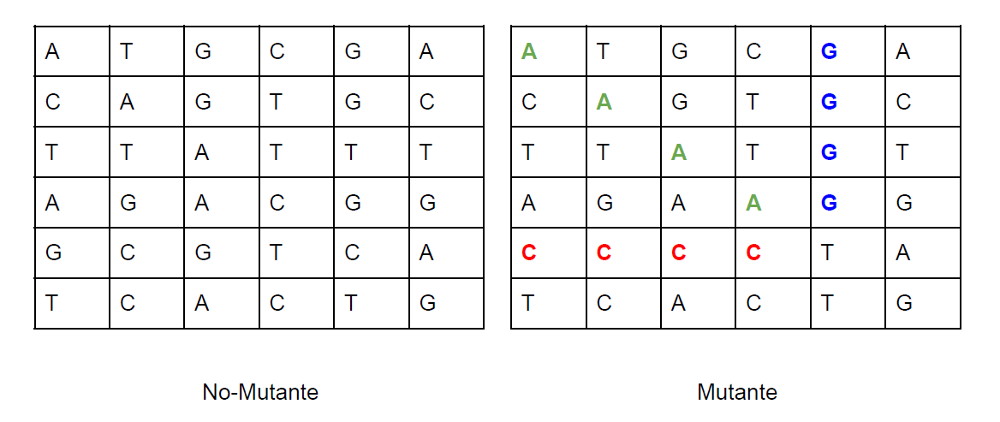

# MELI MUTANT

## #ChallengeMELI
Algoritmo para cooperar con Magneto en el reclutamiento de la mayor cantidad de mutantes y derrotar a los X-Men.

- [Introduccion](#introduccion)
- [Desafios](#desafios)
- [Forma de Uso](#forma-de-uso)

## Introduccion
Magneto quiere reclutar la mayor cantidad de mutantes para poder luchar contra los X-Men.
Te ha contratado a ti para que desarrolles un proyecto que detecte si un humano es mutante basándose en su secuencia de ADN.

Para eso te ha pedido crear un programa con un método o función con la siguiente firma (En
alguno de los siguiente lenguajes: Java / Golang / C-C++ / Javascript (node) / Python / Ruby):

                        boolean isMutant(String[] dna); // Ejemplo Java

En donde recibirás como parámetro un array de Strings que representan cada fila de una tabla de (NxN) con la secuencia del ADN. Las letras de los Strings solo pueden ser: **(A,T,C,G)**, las cuales representa cada base nitrogenada del ADN.

<p align="center">
  
</p>

Sabrás si un humano es mutante, si encuentras **(más de una secuencia de cuatro letras iguales)**, de forma oblicua, horizontal o vertical.

## Desafios

1. Programa el codigo que cumpla con el método pedido por Magneto

2. Crear una API REST, hostear esa API en un cloud computing libre (Pivotal
CloudFoundry, Google App Engine, Amazon AWS, etc), crear el servicio “/mutant/” en donde
se pueda detectar si un humano es mutante enviando la secuencia de ADN mediante un
HTTP POST con un Json el cual tenga el siguiente formato:

     POST → /mutant/ {“dna”:["ATGCGA","CAGTGC","TTATGT","AGAAGG","CCCCTA","TCACTG"]}

*En caso de verificar un mutante, debería devolver un HTTP 200-OK, en caso contrario un
403-Forbidden*

3. Anexar una base de datos, la cual guarde los ADN’s verificados con la API.
Solo 1 registro por ADN. Exponer un servicio extra “/stats” que devuelva un Json con
las estadísticas de las verificaciones de ADN: {“count_mutant_dna”:40,
“count_human_dna”:100, “ratio”:0.4}

*Tener en cuenta que la API puede recibir fluctuaciones agresivas de tráfico (Entre 100 y 1
millón de peticiones por segundo).

-----

## Forma de Uso

## Tecnología de desarrollo
Python Flask 3.9.2

## Motor de base de datos
SQLite 3

### Crear base de datos
  #### Ejecutar
  1. sqlite3 pathfile/Mutants.bd
  2. crate table if no exist stats(id Integer Primary Key Autoincrement, entityd_id Text, is_mutant Boolean)

## Requisitos

## RUN APP
  1. pip install -r requirements.txt

  2. python main.py

## Test Endpoint mutant
### Ejecutar
  1. locust -f \pathfile\meli-mutant\test.py --host={add Running on URL:PORT}
  2. Iniciar la interfaz web en localhost:8089

### Endpoint mutant
El cual se encarga a partir de un array de string (String[]) comprobar si el ADN es mutante o humano:

### Peticion HTTP
```
POST /mutant
Content-Type: application/json
{ "dna":["ATGCGA","CAGTGC","TTATGT","AGAAGG","CCCCTA","TCACTG"] }
```

### Endpoint stats
El cual se encarga de devolver las estadísticas de las verificaciones de ADN

### Peticio HTTP
```
GET localhost/stats
```

## License

[MIT](https://choosealicense.com/licenses/mit/)